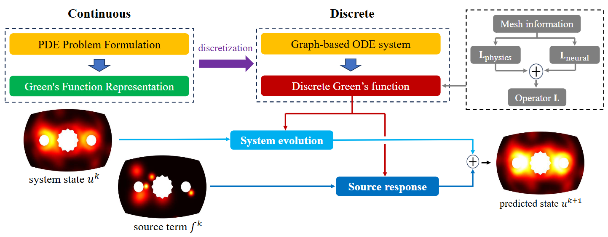

# DGNet

Official PyTorch implementation of the paper [DGNet: Discrete Green Networks for Data-Efficient Learning of Spatiotemporal PDEs](https://openreview.net/forum?id=EJ8HnNTEAv&referrer=%5BAuthor+Console%5D%28%2Fgroup%3Fid%3DICLR.cc%2F2026%2FConference%2FAuthors%23your-submissions%29) published in ICLR 2026.



## Environment

Python 3.10 is recommended. This project uses two environment parts:

### 1) Deep learning environment (DGNet method)

The core DGNet method is implemented with the PyTorch stack.

- PyTorch 2.5.1
- PyTorch Geometric 2.6.1
- CuPy 13.6.0

### 2) Scientific computing environment (dataset generation)

Dataset generation depends on FEniCSx-based scientific computing tools.

- DOLFINx 0.9.0
- Gmsh 4.14.0
- UFL 2024.2.0
- mpi4py 4.1.0

If only the provided `pde_trajectories.h5` dataset is used (without generating new data), this part FEniCSx environment is not required.

## Experiments

### 1) Dataset generation

To generate PDE data , run:

```
python generate_laser_data.py
```

This generates the dataset and corresponding mesh/trajectory visualizations.

Alternatively, the provided dataset can be used directly: [Download pde_trajectories.h5](https://cloud.tsinghua.edu.cn/d/28198824dd3e458ead28/).
Place `pde_trajectories.h5` in the `data_laser_hardening/` folder.

### 2) Training

To train DGNet, run:

```
torchrun --nproc_per_node=4 train.py
```

This configuration is based on 4 × RTX 4090 GPUs (24 GB each) with DDP (Distributed Data Parallel).
For different hardware, adjust parameters in `train.py` or configure DDP accordingly.

Compared with the original paper description, this implementation includes slight adjustments to showcase data efficiency.
In the current setup, training can be completed in about 15 minutes with supervision from 32 trajectories.

### 3) Inference

To run inference and export visualizations, run:

```
python inference.py
```

Visualization outputs are saved in `inference_results/`, showing ground truth vs. prediction.
The script also reports MSE and RNE metrics.